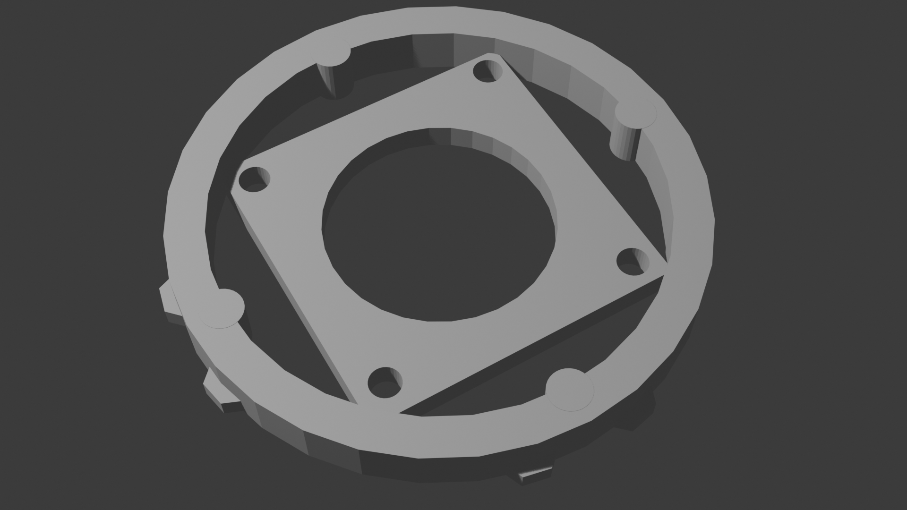
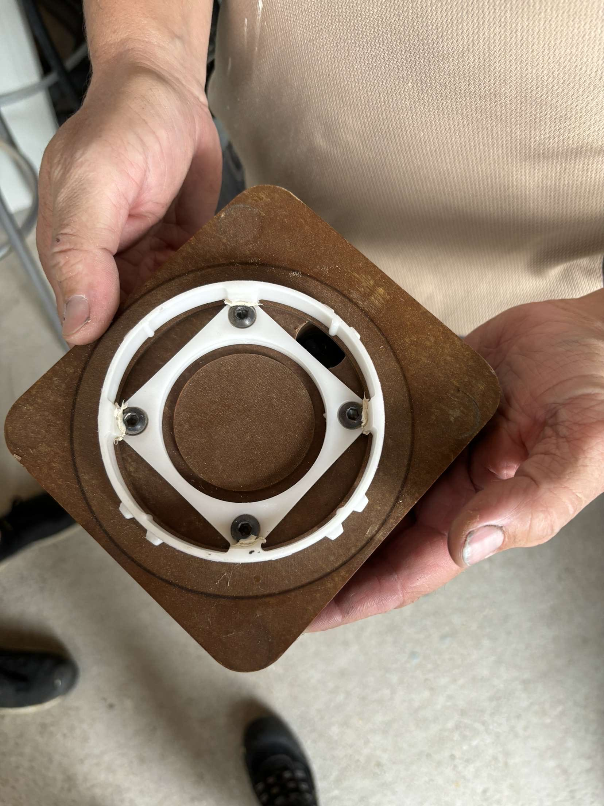
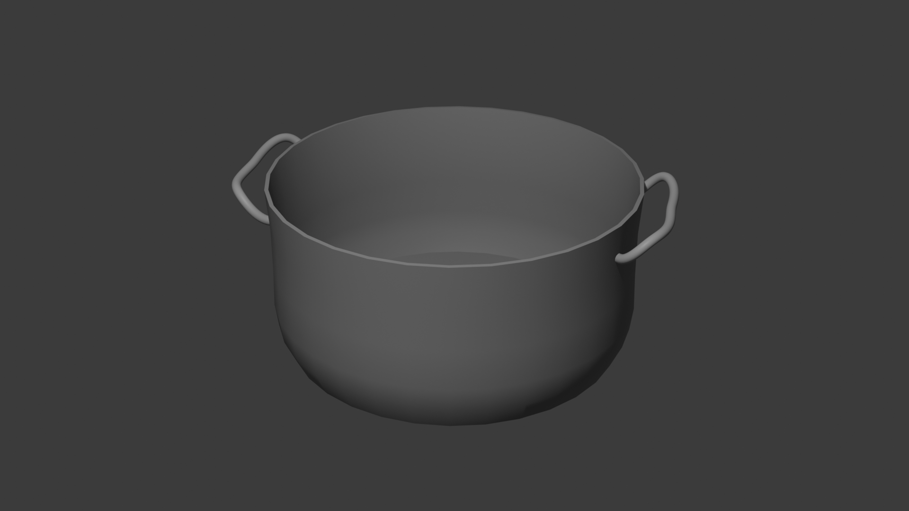
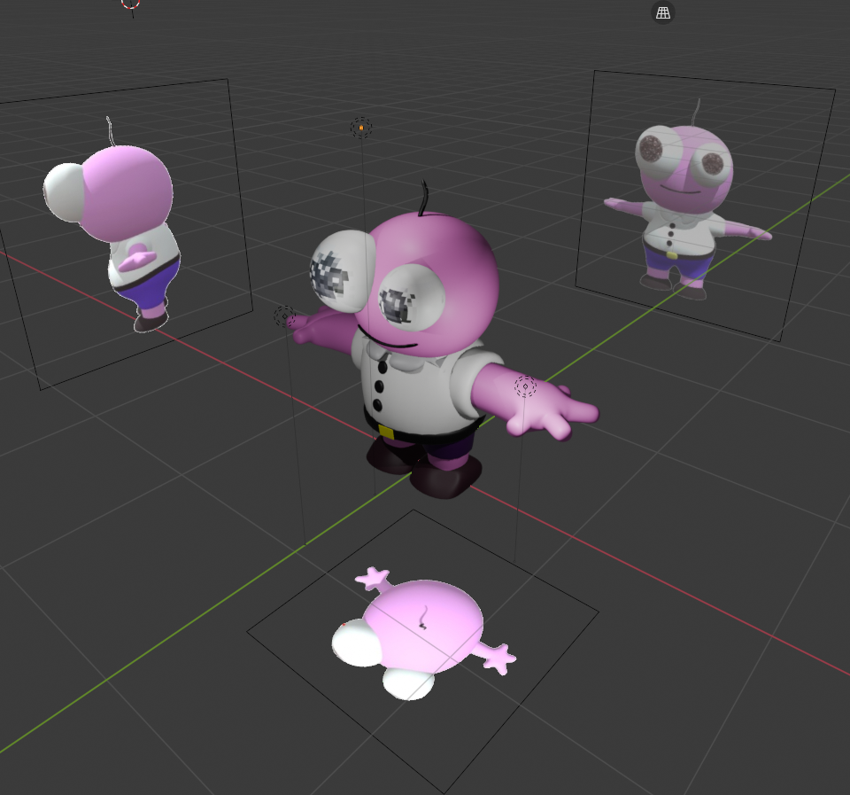

# 3D Models Repository

Welcome to my 3D models repository! Here you'll find a collection of `.blend` files along with preview images in PNG format.

## Models

| Model Name | Preview | References |
|------------|---------|---------|
| Donut    |  |  |
| Pan    |  |  |
| AC piece    |  |  |
| Saucepan    |  |  |
| Pim smiling friends    |  |  |